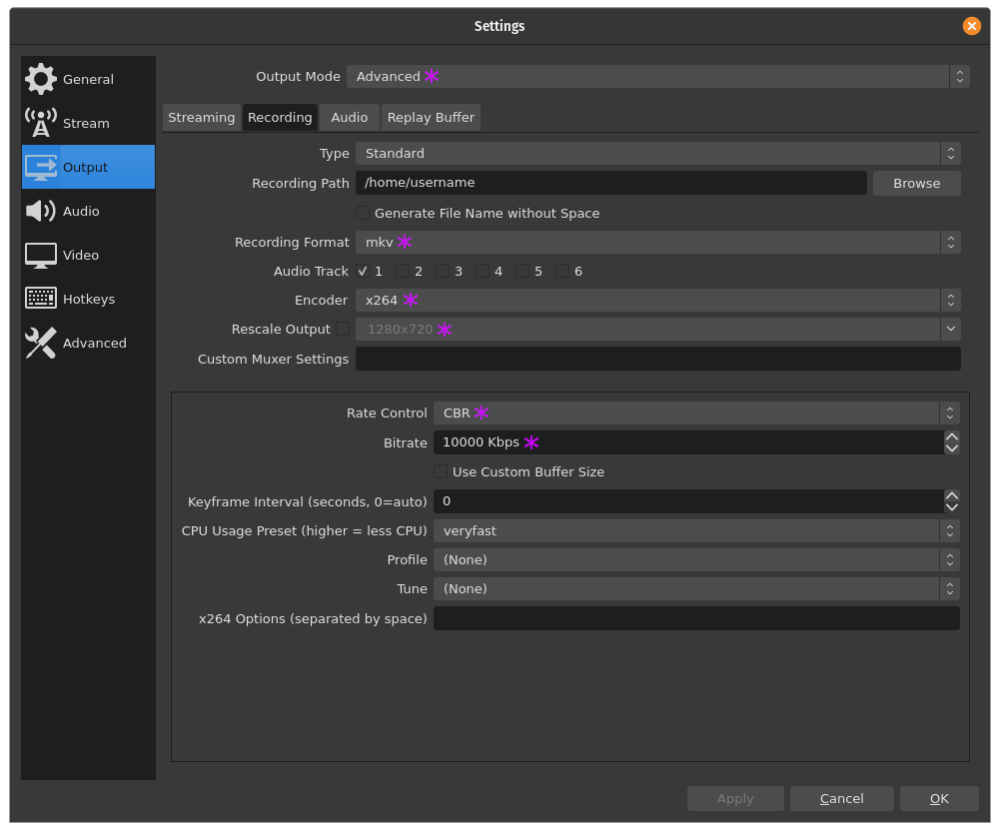
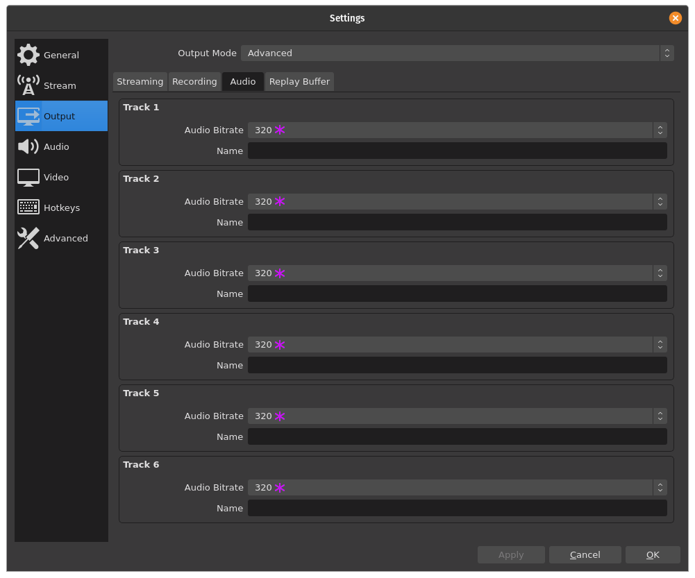

# Open Broadcaster Software (OBS)

This document has instructions for making recordings or doing live streaming
with [OBS Studio](https://obsproject.com/). This is free and open source
software which runs on Windows, macOS and Linux.

## 1 Summary

In general, these are the technical specifications:
- resolution: [1080p](https://en.wikipedia.org/wiki/1080p) (preferred) or
[720p](https://en.wikipedia.org/wiki/720p)
- frame rate: 30 [FPS](https://en.wikipedia.org/wiki/Frame_rate)
- video quality: 5 - 10 Mpbs
- audio quality: 256 kbps, 320 kbps (preferred) or higher
- audio sampling frequency: [44.1 kHz](https://en.wikipedia.org/wiki/44,100_Hz)

## 2 Installation

Install the latest version of OBS from their website.

For Linux, use their PPA to get the latest version and automatically keep it up
to date. Many Linux distributions ship OBS, but this is often an older version.

### 2.1 Configuration

When starting OBS for the first time, an auto-configuration wizard is started.
Choose a `Base (Canvas) Resolution` of `1920x1080` and `30` for `FPS`. For both,
preferably not the `Use Current` version, but only these values.

Because resolution and frame rate has been set here, other settings will follow
this and usually do not need to be set to this too.

### 2.2 Cameras

First, make sure the needed docks are shown. Go in the menu to `View` and under
`Docks` check at least `Scenes`, `Sources`, `Audio Mixer` and `Controls`.

Connect two or three USB cameras. Then, create `Scenes` for each camera. For
each scene, go to `Sources` and add one camera as a `Video Capture Device`.
Then, drag and drop that source into the video preview and resize the view to
match the entire preview.

If a camera has a microphone, mute the microphone in the camera settings. Also
disable autofocus of the camera as it usually has unintended effects.

If you are certain the camera is at the desired resolution and frame rate, keep
those settings at `Leave Unchanged`. Otherwise, set these explicitly. Note that
many cameras offer only trade-offs between resolution and frame rate, preventing
setting both to maximum.

To test the scenes, choose to `Studio Mode` in te lower right of the screen.
Then, switch between the scenes by selecting them. The buttons for `Transition`
and `Cut` in the middle of the screen will swap the view from the program
scene to the previewed scene. This might need some practicing. Best is to have
someone else to the switching of cameras while you perform.

Note that some cameras can also capture audio. Double check that this audio is
not being used in the audio mixer. Also disable autofocus of each camera and
use a fixed focus.

If you are performing by yourself, an automated scene switcher such as
https://obsproject.com/forum/resources/advanced-scene-switcher.395/ is very
helpful.

When another application is used to mix the video, for example Resolume, only
the resulting video should be added as NDI.

## 3 Recording

To make a recording to send in for exclusive broadcasting, make the following
steps.

Go in the menu to `File` and choose `Settings`. Then under `Output`, choose
`Advanced` for `Output Mode`.

### 3.1 Output Recording

Then, in the `Recoding` tab, set the recording path to what you prefer.
Essential is to make the settings:
1. Set the `Recording Format` to `mp4` and enable the audio tracks you use.
2. Set `Encoder` to `x264`
3. **Only** when working with other resolutions, enable `Rescale Output` and
choose `1920x1080`. *
4. For `Rate Control` choose `CBR` (probably already set to that).
5. Below that, set a `Bitrate` of `10000 kbps`. (10 Mbps) *

### 3.2 Output Audio

In the `Audio` tab:
1. Set for all tracks the `Audio Bitrate` to `320`. *

### 3.3 Video

In the `Video` settings, set all resolutions and frame rates as is desired.

### 3.4 Alternative settings *

In case your device cannot cope with these settings, make the following changes
to settings indicated with an * under `Recording`:
* set `Rescale Output` to `1280x720`
* set `Bitrate` to `5000 kbps` (5 Mbps)
* set `Audio Bitrate` to `256 kbps`

### 3.5 Fixing delay

Choose in the menu `Edit` the menu item called `Advanced Audio Properties`.
There you can set a positive or negative `Sync Offset` in milliseconds for each
audio source.

### 3.6 Recording, texts, logos, etc.

Record **without** any logos or text in the video! Also, do not make
announcements in the audio.

A recording by a DJ should be minimally 30 minutes and maximum 60 minutes long.
A live production ha a maximum of 45 minutes. Good to do some proper testing
before doing a recording. Close other applications and mute notification sounds
from your device. View your recording before sending it in to double check all
went OK.

To avoid audio clipping, make sure the volume does not go into the red, also for
any sound cards in between. As a safety precaution, use an independent MP3
recorder to records the audio of your set too. this has proven very useful!

Use a clapperboard or clapping your hands in front of all cameras to help you
fix their delay with the audio.

If you have, for example, two artists recording directly after each other at the
same location, make two separate recordings from it please.

Provide the following text the accompanying message when sending in a recording:
* artist name, in proper upper and lower case characters and spaces where needed
because we don't want to guess the correct spelling
* English name of the city and country where the recording was made
* date when the recording was made, if possible also the start time

If desired, also send in a logo as a PNG or PDF file. Use a transparent
background when needed.

**IMPORTANT:** When you send in any recording, you agree with exclusive
broadcasting rights until two weeks after the first broadcast. Then your
recording will be added to the online archive. From then on, you can share it
all you want. Do not leak or share the recording before that. Doing so will
exclude the recording from broadcasting.

If you have any questions, such as personal upload instructions or help setting
up OBS, please contact us via email or in the chat.

## 4 Streaming

Instructions for live streaming will be added here soon.

## 5 Tools

In some cases the following free and open source tools can be useful:
- [FFmpeg](https://ffmpeg.org/)
- [Audacity](https://www.audacityteam.org/)
